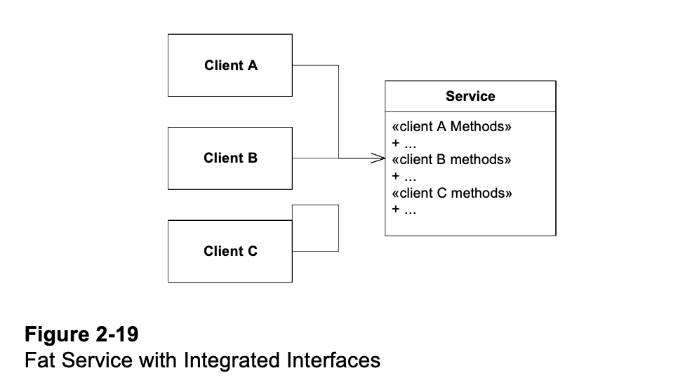
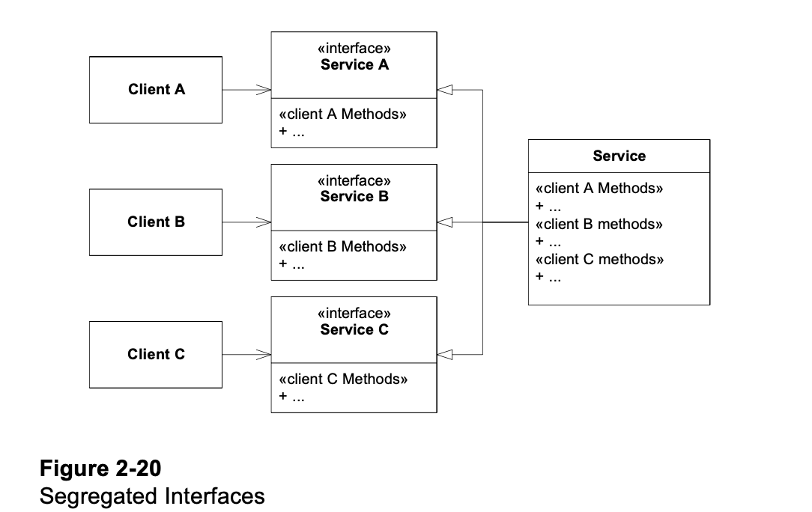
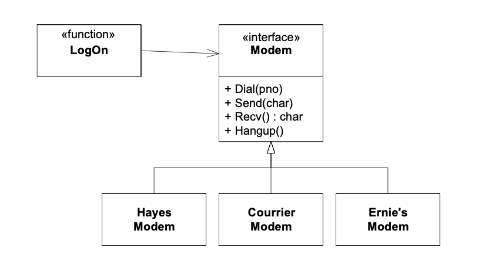
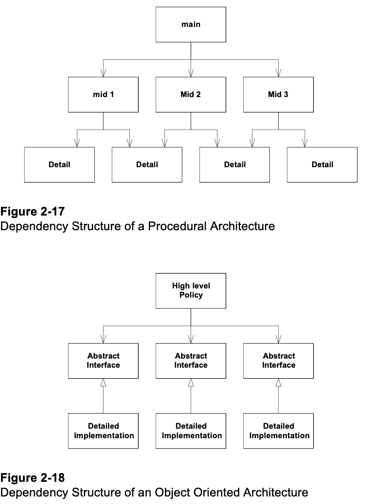

# SOLID Notes

- See [SOLID Columns by "Uncle Bob" Martin](https://moodle.bbk.ac.uk/mod/folder/view.php?id=2475182).
- General principles of good software design -- flexible, robust to change, not fragile.
- But just for this talk, I will call it "SIOLD"! Rearranging the order of the principles, in the hope that this version
  of the story is easier to digest.

# Preliminary

- Difference(s) between a class and an interface? An abstract class?

# About the Demo...

- Like a pottery class... "Make your own jug"
- Definitely not a single answer!
- Could have several approaches to all 5 parts.
- We'll discuss some of these at the end of the session.

# S = Single-Responsibility Principle

- "Don't do everything in one class!"

- *Step 1: Break large classes into smaller ones*

- The messier the code looks, the more likely the class is doing too much.
- Look at each block of code and try to summarise what it's doing ("responsibilities").
- How many responsibilities can you find in the class?
- Create new classes that do these things, and call their methods in the parent class.

# I = Interface Segregation

- "Many client specific interfaces are better than one general purpose interface."

- *Step 2: Break large interfaces into smaller ones*

- When a piece of functionality is important in many places, its interface "can offer too many services to too many
  clients".
- Like "S" (Single-responsibility) for classes, it's best to keep interfaces small so change is manageable.
- Solution: Note that a class can implement multiple interfaces (whereas it can extend only one parent class).
- Rather than implementing one big interface, split the interface into multiple smaller ones, and implement all of them.

# O = Open-Closed Principle

- "A module should be open for extension but closed for modification."

- *Step 3: Collect concrete classes into a hierarchy*

- Now you have a bunch of new classes that implement some functionality ("features").
- Each extra feature needs changes in the classes that use it.
- Design the code to minimise those changes.

- The main technique: polymorphism -- "make related features into subclasses of a parent class".
- New features can be substituted for old ones without* changing the old code.

- (*Some code must still choose which classes to use! But ideally it will be one place. Or even no places -- see "
  dependency injection" in Week 4.)

- Fewer files to change: Simplifies coding, building and testing the code.

# L = Liskov Substitution Principle

"Subclasses should be substitutable for their base classes."

*Step 4: Get the subclasses right*

- How to organise all these new classes correctly in hierarchies?
- Each class (or "type") in your program has an implicit contract, and its methods have pre- and post-conditions.
- E.g. A phone makes and receives calls. A smartphone can also install and run apps.
- "You can use a smartphone if you just need a phone, but a phone might not be enough if you need a smartphone".
- Make sure your subclasses / implementations (SmartPhone) satisfy the contracts of the parent class / interface (Phone)
  .

# D = Dependency Inversion

"Depend upon Abstractions. Do not depend upon concretions."

*Step 5: Make the parent classes of the hierarchy as abstract as possible, or into interfaces*

- The features at the top of the system design, depend on the lower-level, concrete components.
- But they shouldn't depend on the concrete components directly.
- Concrete classes are likely to change a lot.
- By contrast, abstract classes and interfaces are more lightweight, and easier to change.
- So the hierarchy of low-level components should have abstract classes and interfaces at the top; and the high-level
  components of the system should depend on these instead.

 